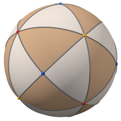
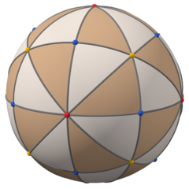
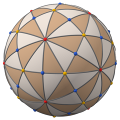
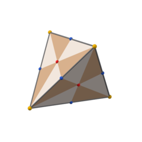
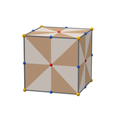
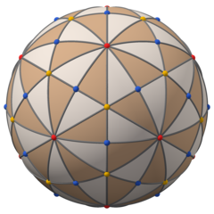

# Disdyakis polyhedra

This folder contains the POV-Ray code for the image set
[Disdyakis polyhedra (light and dark brown)](https://commons.wikimedia.org/wiki/Category:Disdyakis_polyhedra_(light_and_dark_brown)).
Technically this project is isolated from the old one, but it uses code from the parent folder.
E.g. [`6-8_deltoidal.inc`](../../../2b_colors_png/finished_pov/disdyakis/6-8_deltoidal.inc)
([image](https://commons.wikimedia.org/wiki/File:Disdyakis_12_in_deltoidal_24.png))
uses code from
[`small_rhombi_6-8_dual.pov`](../../../2b_colors_png/finished_pov/8/small_rhombi_6-8_dual.pov)
([image](https://commons.wikimedia.org/wiki/File:Polyhedron_small_rhombi_6-8_dual.png)).

<table>
<tr>
  <td>
      
  </td>
  <td>
      
  </td>
  <td>
      
  </td>
</tr>
<tr>
  <td>
    <a href="../../../2b_colors_png/finished_pov/disdyakis/4-4_spherical.pov"><code>4-4_spherical.pov</code></a>
  </td>
  <td>
    <a href="../../../2b_colors_png/finished_pov/disdyakis/6-8_spherical.pov"><code>6-8_spherical.pov</code></a>
  </td>
  <td>
    <a href="../../../2b_colors_png/finished_pov/disdyakis/12-20_spherical.pov"><code>12-20_spherical.pov</code></a>
  </td>
</tr>
<tr>
  <td>
      
  </td>
  <td>
      
  </td>
  <td>
      
  </td>
</tr>
<tr>
  <td>
    <a href="../../../2b_colors_png/finished_pov/disdyakis/4-4.pov"><code>4-4.pov</code></a> 
    <a href="../../../2b_colors_png/finished_pov/disdyakis/4-4_tetra_a.inc"><code>4-4_tetra_a.inc</code></a>
  </td>
  <td>
    <a href="../../../2b_colors_png/finished_pov/disdyakis/6-8.pov"><code>6-8.pov</code></a> 
    <a href="../../../2b_colors_png/finished_pov/disdyakis/6-8_hexa.inc"><code>6-8_hexa.inc</code></a>
  </td>
  <td>
    <a href="../../../2b_colors_png/finished_pov/disdyakis/12-20.pov"><code>12-20.pov</code></a> 
    <a href="../../../2b_colors_png/finished_pov/disdyakis/12-20_dodeca.inc"><code>12-20_dodeca.inc</code></a>
  </td>
</tr>
</table>

The orthographic projections from different axes have not (as in the older project) been done by putting the camera on that axis, but by putting the camera in front, and rotating the object using [`RotateDirOnDir.inc`](https://github.com/watchduck/polyhedron_skeletons/blob/master/pov_macros/RotateDirOnDir.inc). This way the light in these files looks the same.

<table>
  <tr>
    <td>
        
    </td>
    <td>
        
    </td>
  </tr>
</table>

For these two views the object has been rotated using 
`RotateDirOnDir(<1,1,-1>, front) rotate 22.695*z` and `RotateDirOnDir(icosa6, front)` 
with `front` = `<0,0,-1>` and `icosa6` = `<0, 1, -(1/2 + sqrt(5)/2)>` (same as `PRot` in [`12-20_spherical_colored.pov`](../../../2b_colors_png/finished_pov/disdyakis/12-20_spherical_colored.pov)). 
This has been done in [footer.inc](../../../2b_colors_png/finished_pov/disdyakis/footer.inc).
Also the `rotate clock/2 * y` for the animations was used there.
