# Convex polyhedra

This collection of code was written mainly to create images of
[Platonic](https://en.wikipedia.org/wiki/Platonic_solid),
[Archimedean](https://en.wikipedia.org/wiki/Archimedean_solid) and
[Catalan](https://en.wikipedia.org/wiki/Catalan_solid) solids. 
Most calculations are done in Python, and the raytracing is done with
[POV-Ray](https://en.wikipedia.org/wiki/POV-Ray).

<table>
  <tr>
    <td width="25%">
      <a href="https://commons.wikimedia.org/wiki/File:Polyhedron_6-8,_davinci.png">
        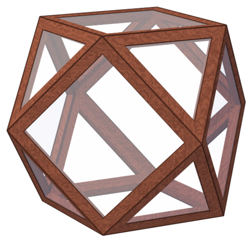
      </a>
    </td>
    <td width="25%">
      <a href="https://commons.wikimedia.org/wiki/File:Polyhedron_6-8_max.png">
        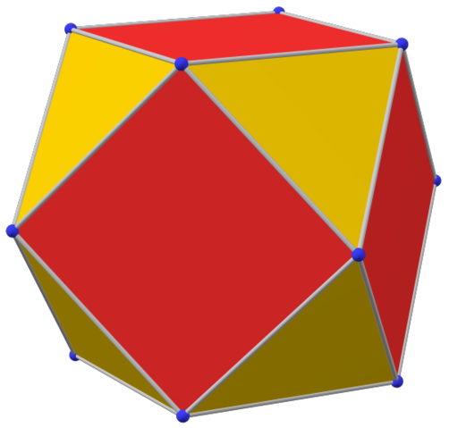
      </a>
    </td>
    <td width="25%">
      <a href="https://commons.wikimedia.org/wiki/File:Polyhedron_6-8_dual_blue.png">
        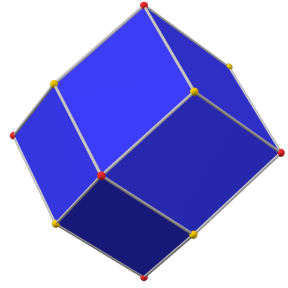
      </a>
    </td>
    <td width="25%">
      <a href="https://commons.wikimedia.org/wiki/File:Dual_compound_6-8_max.png">
        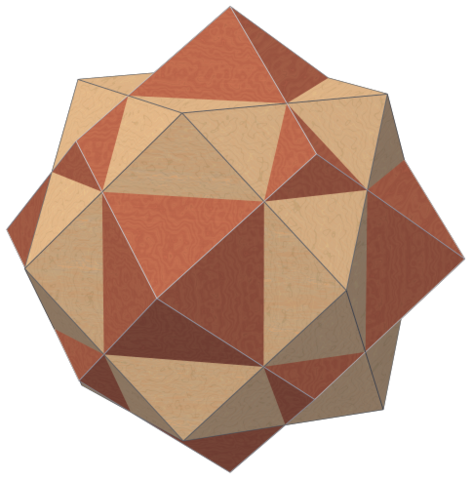
      </a>
    </td>
  </tr>
  <tr>
    <td>
      <a href="https://commons.wikimedia.org/wiki/File:Polyhedron_truncated_20,_davinci.png">
        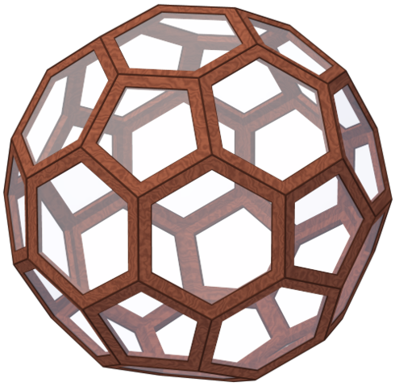
      </a>
    </td>
    <td>
      <a href="https://commons.wikimedia.org/wiki/File:Polyhedron_truncated_20_max.png">
        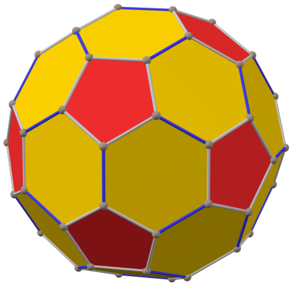
      </a>
    </td>
    <td>
      <a href="https://commons.wikimedia.org/wiki/File:Polyhedron_truncated_20_dual_max.png">
        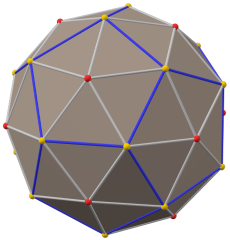
      </a>
    </td>
    <td>
      <a href="https://commons.wikimedia.org/wiki/File:Dual_compound_truncated_20_max.png">
        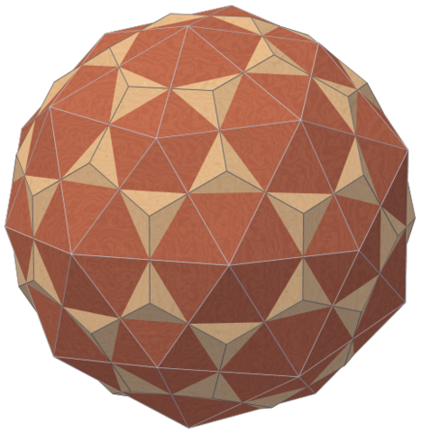
      </a>
    </td>
  </tr>
  <tr>
    <td>
      <a href="https://commons.wikimedia.org/wiki/Category:Platonic,_Archimedean_and_Catalan_solids,_rendered_images_similar_to_da_Vinci_drawings">
        da Vinci
      </a>
    </td>
    <td colspan="2">
      <a href="https://commons.wikimedia.org/wiki/Category:Platonic,_Archimedean_and_Catalan_solids_with_direction_colors">
        direction colors
      </a>
    </td>
    <td>
      <a href="https://commons.wikimedia.org/wiki/Category:Dual_compounds_of_wooden_Platonic,_Archimedean_and_Catalan_solids">
        dual compounds
      </a>
    </td>
  </tr>
</table>

The solids with direction colors were created to illustrate Wikipedia articles,
while the initial motivation to create the da Vinci solids was to create
[3D chess](https://en.wikiversity.org/wiki/Three-dimensional_chess) figures.
This is essentially code written to be used once, and not a library,
but it may be useful for convex polyhedra in general.
Unexpected things may happen when the origin is not the center of the polyhedron,
or when the [normal](https://en.wikipedia.org/wiki/Normal_(geometry)) point of an element is not
properly inside of it (like for some [parallelepipeds](https://en.wikipedia.org/wiki/Parallelepiped)).
SymPy does not give correct results for coordinates that are too complicated, like those of the
[snub cube](https://en.wikipedia.org/wiki/Snub_cube).
(And even if it worked, the calculation would take too long.)
Rounded values can be used instead, but this usually means that faces with more than three vertices
remain just a collection of triangles.
(For the snubs and their duals the wrong edges were removed manually.)
The handling of degenerate cases
([the polyhedron](https://commons.wikimedia.org/wiki/File:Subgroup_of_Oh;_C2%5E3_white;_solid.png)
becomes
[a polygon](https://commons.wikimedia.org/wiki/File:Subgroup_of_Oh;_V_inv_white_16;_solid.png))
worked well enough where it was needed, but should not be trusted.

## Classes

The main class in this project is
[`Polyhedron`](https://github.com/watchduck/convex_polyhedra/blob/master/classes/polyhedron.py),
which is typically initialized with a list of points.

[`ConvexHull`](https://docs.scipy.org/doc/scipy/reference/generated/scipy.spatial.ConvexHull.html)
from SciPy is used to find faces and edges, but it returns just a collection of triangles. 
In the next step pairs of coplanar triangles are found and the edges between them removed.

The main methods of this class produce arrays to be used by POV-Ray.

The concept of direction colors has been added to this class after it was finished,
and in a rather clunky way.

There are classes like
[`Polygon`](https://github.com/watchduck/convex_polyhedra/blob/master/classes/polygon.py)
for the other dimensions.
Their methods like `__repr__`, `__hash__`, `__eq__` and `__lt__`  have been modified
to make it possible to compare ordered lists of these objects for equality.

Examples for the [truncated cuboctahedron](https://en.wikipedia.org/wiki/Truncated_cuboctahedron):

<table>
  <tr>
    <td width="25%">
        <a href="https://commons.wikimedia.org/wiki/File:Truncated_cuboctahedron,_ball-and-stick,_triangles.png">
            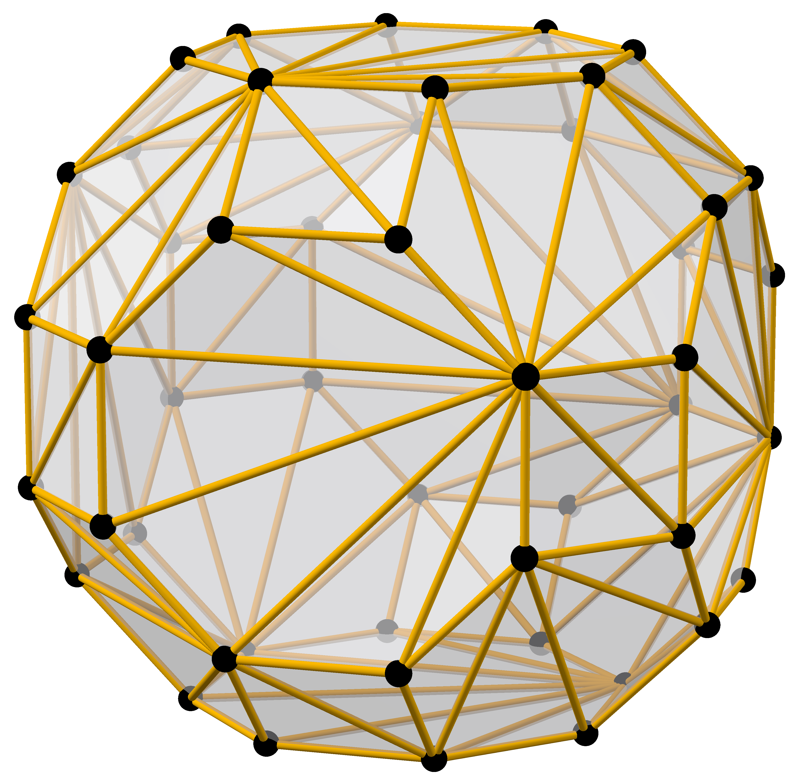
        </a>
    <td width="25%">
        <a href="https://commons.wikimedia.org/wiki/File:Truncated_cuboctahedron,_ball-and-stick.png">
            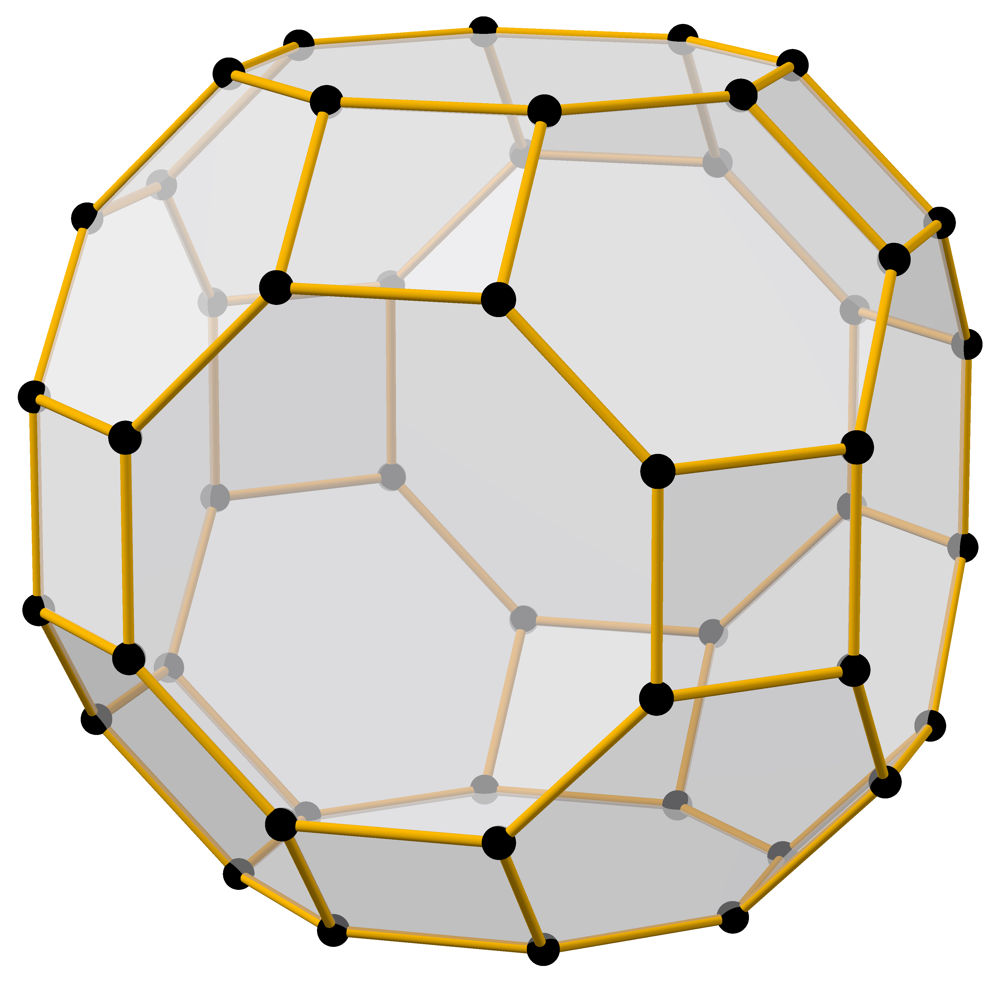
        </a>
    <td width="25%">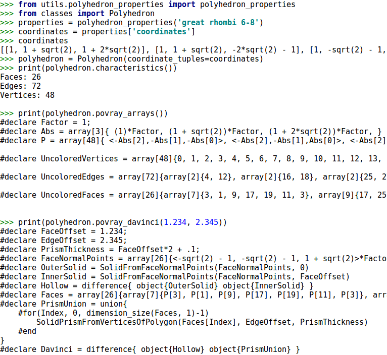
    <td width="25%">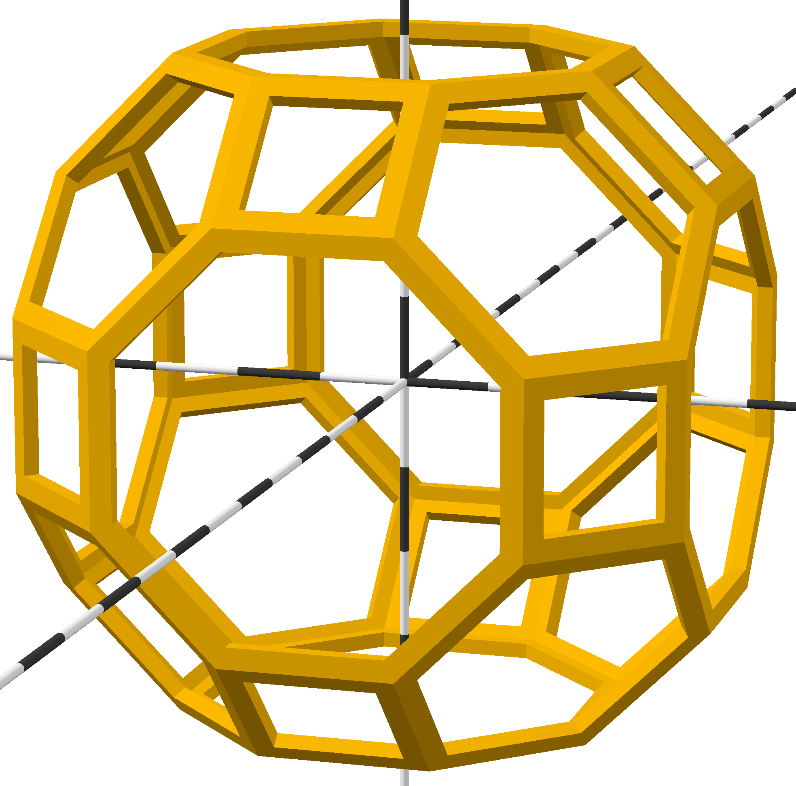
  <tr>
    <td colspan="2">
      Before
      (<a href="https://github.com/watchduck/convex_polyhedra/blob/master/povray_includes/examples/ball-and-stick_truncuboct_triangles.pov">source</a>)
      and after
      (<a href="https://github.com/watchduck/convex_polyhedra/blob/master/povray_includes/examples/ball-and-stick_truncuboct.pov">source</a>)
      removing the edges between coplanar triangles
    <td>Create polyhedron and print POV-Ray arrays
    <td>
      <a href="https://en.wikipedia.org/wiki/Constructive_solid_geometry">CSG</a> solid
      (<a href="https://github.com/watchduck/convex_polyhedra/blob/master/povray_includes/examples/davinci_truncuboct.pov">source</a>)
</table>

For many polyhedra the coordinates along with some radii are found in
<code>utils/<a href="https://github.com/watchduck/convex_polyhedra/blob/master/utils/polyhedron_properties.py">polyhedron_properties</a></code>.

## Subprojects

<a href="https://commons.wikimedia.org/wiki/File:Subgroup_of_Oh;_V_yellow_white_07;_solid.png">
  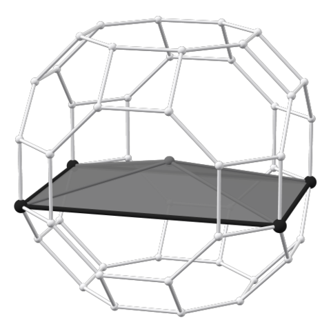
</a>

### 1. Full octahedral group

The code in
[`1_full_octahedral_group`](https://github.com/watchduck/convex_polyhedra/tree/master/1_full_octahedral_group)
was used to create illustrations of subgroups for the Wikiversity article
[Full octahedral group](https://en.wikiversity.org/wiki/Full_octahedral_group#List_of_all_subgroups).
The vertices of the truncated cuboctahedron correspond to elements of this group,
and the convex hulls of these vertices for each subgroup are created here.

A light gray vertex in the origin has been added to degenerate polyhedra (single faces or edges)
that do not contain the origin. But the code to do that has been removed.
So has the code that handled polyhedra degenerated to single edges.

### 2. Direction colors

This code was used to create Platonic, Archimedean and Catalan solids (as well as some
[chamfers](https://en.wikipedia.org/wiki/Chamfer_(geometry))) in which corresponding elements have the same color.
Elements containing a 2-fold symmetry axis are blue. For solids with octahedral symmetry 3-fold is yellow
and 4-fold is red.
By default these solids are shown with the same
[midsphere](https://en.wikipedia.org/wiki/Midsphere).

In
[`2a_colors_pov`](https://github.com/watchduck/convex_polyhedra/tree/master/2a_colors_pov)
the POV-Ray files are created along with test images.
(They include the midsphere to verify that the size is correct.)
The actual images are created in a second step in
[`2b_colors_png`](https://github.com/watchduck/convex_polyhedra/tree/master/2b_colors_png),
where these files have been turned into templates.
(For the snubs and their duals the templates contain substantial manual improvements.)

The templates take the variable `Factor`, which decides how big
the solid will be. This handling of different sizes is necessary because of a few solids like the
[cuboctahedron](https://en.wikipedia.org/wiki/Cuboctahedron) and the
[rhombic dodecahedron](https://en.wikipedia.org/wiki/Rhombic_dodecahedron).
Apart from the representation with the standard midsphere they are also needed as
[core](https://commons.wikimedia.org/wiki/File:Polyhedron_6-8_blue.png) and
[hull](https://commons.wikimedia.org/wiki/File:Polyhedron_6-8_dual_blue.png) of the
[compound of cube and octahedron](https://commons.wikimedia.org/wiki/File:Polyhedron_pair_6-8.png).
Which size is rendered depends on the value of `image_set` in
[`run.py`](https://github.com/watchduck/convex_polyhedra/blob/master/2b_colors_png/run.py).

The POV-Ray include file `polyhedra_colors.inc`
is generated from
[`polyhedra_colors_include.tpl`](https://github.com/watchduck/convex_polyhedra/blob/master/2b_colors_png/polyhedra_colors_include.tpl)
before the image is rendered.
It contains `camera_position` and related values, depending on which value is set for `perspective` in `run.py`.
(<code>povray_includes/<a href="https://github.com/watchduck/convex_polyhedra/blob/master/povray_includes/polyhedra_colors.inc">polyhedra_colors.inc</a></code>
is the version for the standard perspective.)

The finished POV-Ray files are in
<code>2b_colors_png/<a href="https://github.com/watchduck/convex_polyhedra/tree/master/2b_colors_png/finished_pov">finished_pov</a></code>.

<a href="https://commons.wikimedia.org/wiki/File:Polyhedron_great_rhombi_6-8,_davinci.png">
  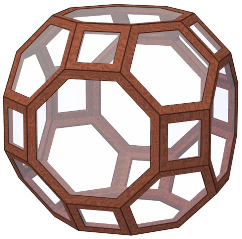
</a>

### 3. Da Vinci solids

This code was used to create renderings of wooden polyhedra similar to drawings by Leonardo da Vinci.
The POV-Ray functions used to create them are in
[**`povray_includes`**](https://github.com/watchduck/convex_polyhedra/tree/master/povray_includes)
, along with more documentation.

In
[`3a_davinci_pov`](https://github.com/watchduck/convex_polyhedra/tree/master/3a_davinci_pov)
the POV-Ray files are created along with test images.
Manually improved versions of these files are then rendered in
[`3b_davinci_png`](https://github.com/watchduck/convex_polyhedra/tree/master/3b_davinci_png).
For most solids only the size and the offsets have been changed,
but substantial changes where necessary for the snubs and their duals.
Their normal points have been created in
<code>misc/<a href="https://github.com/watchduck/convex_polyhedra/tree/master/misc/create_snub_normal_points">create_snub_normal_points</a></code>.

In
[`3c_numbers`](https://github.com/watchduck/convex_polyhedra/tree/master/3c_numbers)
auxiliary images like
[this](https://commons.wikimedia.org/wiki/File:Polyhedron_great_rhombi_6-8,_numbers.png)
have been created. They show the index of each vertex (counted from 0)
when the coordinates are in lexicographical order. This is the index in the POV-Ray array `P`.

### 4. Dual compounds

In
[`4_dual_compounds`](https://github.com/watchduck/convex_polyhedra/tree/master/4_dual_compounds)
images like
[this](https://commons.wikimedia.org/wiki/File:Dual_compound_great_rhombi_6-8_max.png)
have been created. The dual polyhedra have the same midsphere.

### Small in great rhombi

In
<code>misc/<a href="https://github.com/watchduck/convex_polyhedra/tree/master/misc/small_in_great_rhombi">small_in_great_rhombi</a></code>
some images are created that show the
[small](https://en.wikipedia.org/wiki/Rhombicuboctahedron) in the
[great](https://en.wikipedia.org/wiki/Truncated_cuboctahedron) rhombicuboctahedron
with the same edge length,
and the equivalents for tetrahedral and icosahedral symmetry.
See
[their category](https://commons.wikimedia.org/wiki/Category:Small_in_great_rhombi_(renderings_of_Archimedean_solids))
on Commons.
